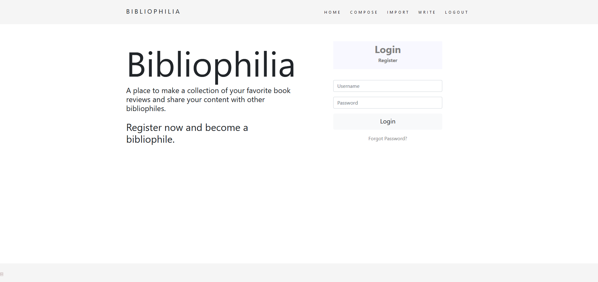
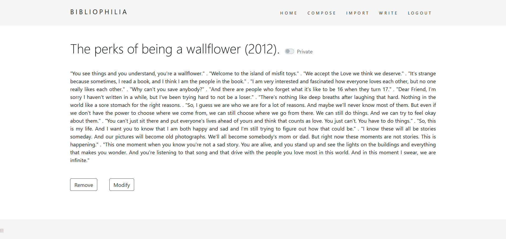
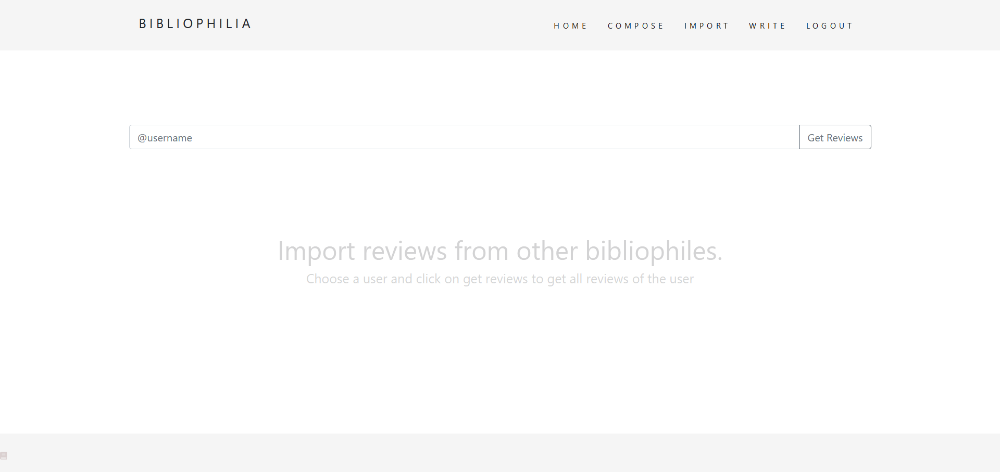
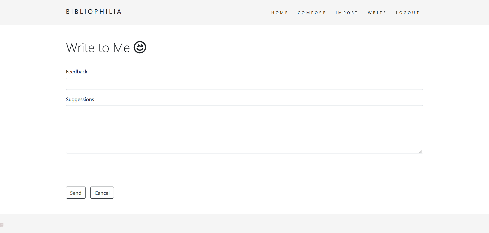
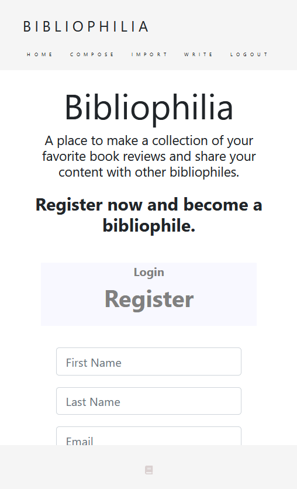

# Bibliophilia
A node.js based web application

Overview: 
Bibliophilia is a word which means "love for books". This application is meant for making a collection of book reviews. Although user's content can be anything. The primary purpose of the application is to serve the features involving CRUD operations on the content. 

Modules used :
Various npm modules and other middlewares have been used in this application. Following are the modules : 

1. Express.js framework for providing abstraction layer and simplifying the code.
2. mongoose middleware for connecting to mongodb
3. body-parser for handling the form request parameters
4. lodash npm module for accessing functions which are helpful in text manipulation in the query string
5. express-session for maintaining session management
6. passport.js for authentication
7. passport-local-mongoose for an additional abstraction as compared to LocalStrategy in passport-local
8. connect-flash for displaying flash messages upon success redirect/failure redirect.
9. mailgun-js for enabling sending email service through application
10. jwt module for implementing and accessing token based service for email verification and resetting password
11. ejs templates for implenting partials and rendering data onto the templates

Special Features: 
1. Maintaining session with passport.js
2. Headers for cache-control to prevent user from entering back into session after logout just by clicking back button.
3. Advance level password hashing with automatic salting rounds in authentication using passport.js as compared to mongoose-encryption, md5 hashing and bcrypt hashing.

Functionalities and Application features :
1. User has to register by providing all details and login.

2. The library would be empty initially. User may compose a new review and add to the library. All the reviews would be displayed on the home page as shown below

3. User may review the posts completely by clicking on read more and would be redirected to a separate route from the home page.

4. User may also import stuff from other users library by searching for other user. All necessary validations have been implemented to ensure that the correct username is being retrieved and displaying error message if the user does not exist. The intresting feature is that there is an option called "keep this private" which lets the user keep his content private and restricts other users access on it. So when a user is trying to import content, only that content would be shown to that user which has public access. 

5. This application has a feedback section in which a user may leave a feedback which is stored in the database and is being considered on suggessions for improvements.

6. This application is mobile friendly. media queries have been used for scaling the components in correspondence with the screen resolution.

THANK YOU FOR SPARING YOUR VALUABLE TIME VIEWING THIS. PLEASE FEEL FREE TO GIVE ANY KIND OF SUGGESSIONS.
